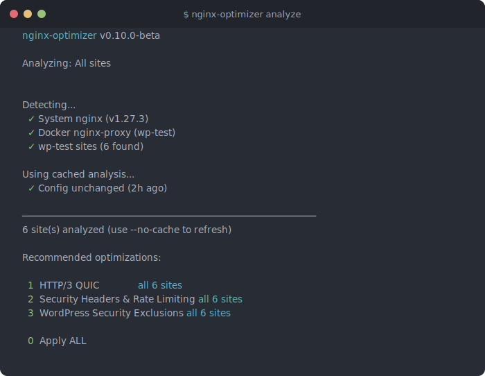
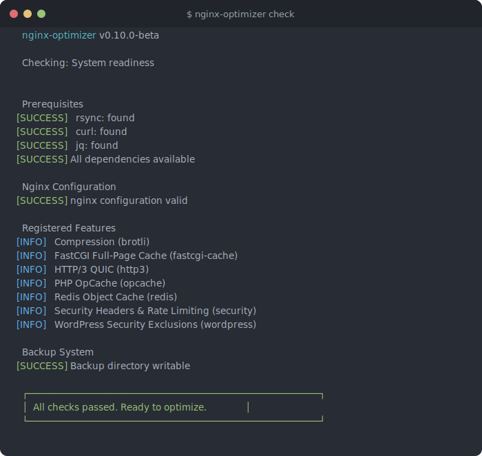
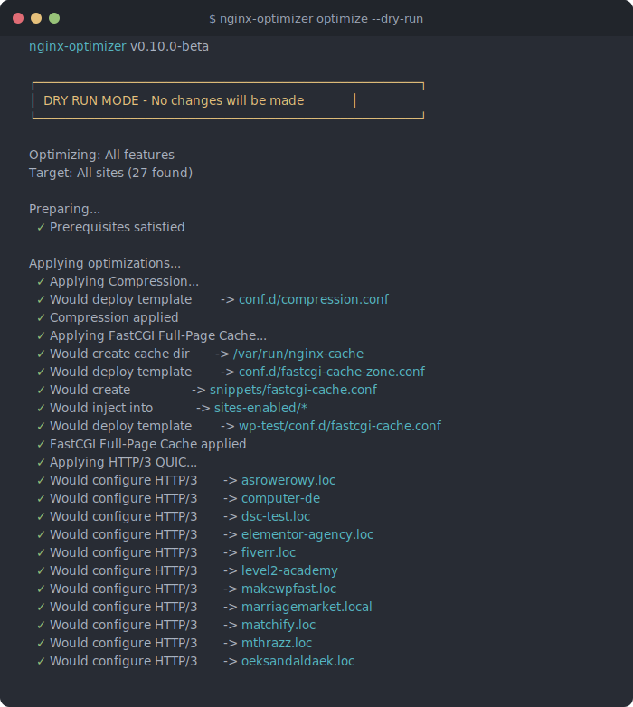
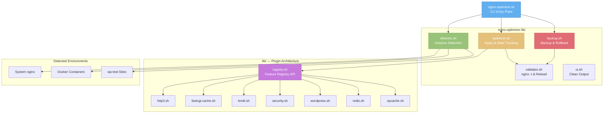
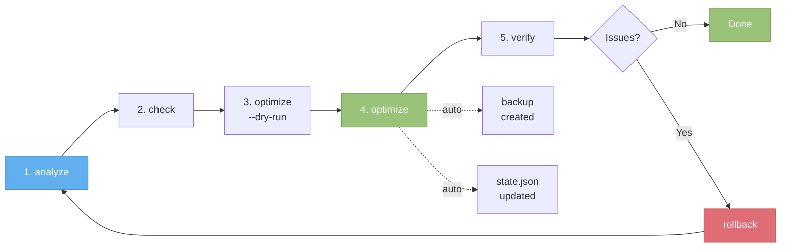

```
                    _                          _   _           _
  _ __   __ _ _ __ (_)_ __  __  ___  _ __  | |_(_)_ __ ___ (_)_______ _ __
 | '_ \ / _` | '_ \| | '_ \ \/ / _ \| '_ \ | __| | '_ ` _ \| |_  / _ \ '__|
 | | | | (_| | | | | | | | |>  < (_) | |_) || |_| | | | | | | |/ /  __/ |
 |_| |_|\__, |_| |_|_|_| |_/_/\_\___/| .__/  \__|_|_| |_| |_|_/___\___|_|
        |___/                         |_|
```

# nginx-optimizer

[](https://github.com/MarcinDudekDev/nginx-optimizer/actions/workflows/ci.yml)
[]()
[]()
[]()

**One command to optimize your entire nginx stack.** HTTP/3, Brotli, FastCGI cache, Redis, security headers, and WordPress-specific optimizations -- with automatic backup and rollback.

**Version:** 0.10.0-beta | **Status:** Beta (production-ready for WordPress sites)

<p align="center">
  
</p>

<details>
<summary><strong>More screenshots</strong></summary>

### Pre-flight Check
<p align="center">
  
</p>

### Dry Run Preview
<p align="center">
  
</p>

</details>

## Installation

### One-liner (Recommended)
```bash
curl -fsSL https://raw.githubusercontent.com/MarcinDudekDev/nginx-optimizer/main/install.sh | bash
```

### Homebrew (macOS)
```bash
brew install --HEAD MarcinDudekDev/tap/nginx-optimizer
```

### Manual
```bash
git clone https://github.com/MarcinDudekDev/nginx-optimizer.git ~/Tools/nginx-optimizer
chmod +x ~/Tools/nginx-optimizer/nginx-optimizer.sh
echo 'export PATH="$PATH:$HOME/Tools/nginx-optimizer"' >> ~/.zshrc
source ~/.zshrc
```

### Man Page
```bash
sudo cp docs/nginx-optimizer.1 /usr/share/man/man1/
man nginx-optimizer
```

## Features

| Feature | What it does | Impact |
|---------|-------------|--------|
| **HTTP/3 (QUIC)** | Modern protocol with 0-RTT connection resumption | 15-25% faster on mobile |
| **FastCGI Full-Page Cache** | Serves static HTML, bypasses PHP entirely | TTFB: 400ms -> 15ms |
| **Redis Object Cache** | Database query caching for logged-in users | 30% fewer DB queries |
| **Brotli + Gzip** | Dual compression with 30+ MIME types | 60-70% bandwidth savings |
| **Security Headers** | HSTS, CSP, X-Frame-Options, rate limiting | F -> A+ security grade |
| **WordPress Hardening** | Block xmlrpc, protect wp-config, wp-includes | Closes OWASP Top 10 vectors |
| **PHP OpCache** | JIT-enabled with optimized buffer sizes | 20-40% faster uncached PHP |
| **WooCommerce Detection** | Auto-applies cart/checkout cache bypass rules | Zero cache poisoning |

**Also included:** Performance benchmarks, monitoring dashboard, bot blocker auto-updates, timestamped backups with one-command rollback, state tracking, and config diff.

## Known Limitations

### HTTP/3 and Self-Signed Certificates

The nginx-optimizer correctly applies HTTP/3 (QUIC) configuration and the server properly sends the `alt-svc: h3=":443"` header. However, modern browsers (Chrome, Brave, Safari) enforce a security restriction that prevents HTTP/3 connections when using self-signed or mkcert-generated certificates.

**Key Points:**
- HTTP/3 configuration IS applied correctly by the optimizer
- The server advertises HTTP/3 support via `alt-svc` header
- Browsers refuse to upgrade to HTTP/3 with self-signed/mkcert certificates for security reasons
- This is a browser security restriction, NOT a configuration issue
- HTTP/3 WILL work in production with proper CA-signed certificates (Let's Encrypt, etc.)
- For local development, HTTP/2 is the maximum protocol version achievable in most browsers
- Firefox can be configured to allow HTTP/3 with self-signed certificates via `about:config` (set `network.http.http3.enable_0rtt` and related flags) for testing purposes

**Verification:** You can confirm HTTP/3 is configured correctly by checking response headers (`alt-svc: h3=":443"`) even though the connection remains on HTTP/2 in local development environments.

## Quick Start

### Interactive Mode (Recommended)
```bash
nginx-optimizer  # Launches interactive wizard
```

### Analyze Current Setup
```bash
nginx-optimizer analyze
```

### Optimize All Sites
```bash
nginx-optimizer optimize --dry-run  # Preview changes first
nginx-optimizer optimize             # Apply optimizations
```

### Optimize Specific wp-test Site
```bash
nginx-optimizer optimize quiz-test.local
```

### Apply Single Feature
```bash
nginx-optimizer optimize --feature http3
nginx-optimizer optimize --feature fastcgi-cache
```

### Exclude Feature
```bash
nginx-optimizer optimize --exclude brotli
```

## Commands

| Command | Description |
|---------|-------------|
| `analyze [site]` | Show current optimization status |
| `optimize [site]` | Apply optimizations (all or specific site) |
| `rollback [timestamp]` | Restore previous configuration |
| `diff [timestamp]` | Show changes between backup and current config |
| `remove [site]` | Remove applied optimizations (with `--feature`) |
| `verify [site]` | Verify applied optimizations match running config |
| `test [site]` | Test nginx configuration |
| `status [site]` | Show optimization status |
| `list` | List all detected nginx installations |
| `benchmark [site]` | Run performance tests |
| `check [site]` | Pre-flight readiness check (deps, config, features) |
| `update` | Self-update from GitHub |
| `help` | Show help message |

## Options

| Option | Description |
|--------|-------------|
| `--dry-run` | Preview changes without applying |
| `--force` | Skip confirmations |
| `--feature <name>` | Apply specific feature only |
| `--exclude <name>` | Skip specific feature |
| `--backup-dir <path>` | Custom backup location |
| `--quiet` | Suppress output (for scripting) |
| `--json` | Output JSON (for status, list, analyze, check) |
| `--no-color` | Disable colored output (also respects `NO_COLOR` env var) |
| `--system-only` | Only operate on system nginx (skip wp-test) |
| `--no-rate-limit` | Disable rate limiting in security config |
| `--check` | Pre-flight check (shorthand for `check` command) |
| `-v, --version` | Show version |

## Available Features

- `http3` - HTTP/3 (QUIC) support
- `fastcgi-cache` - Full-page FastCGI caching
- `redis` - Redis object caching
- `brotli` - Brotli + Zopfli compression
- `security` - Security headers + rate limiting
- `wordpress` - WordPress-specific exclusions
- `opcache` - PHP OpCache optimization

## Directory Structure

```
nginx-optimizer/
├── nginx-optimizer.sh           # Main executable
├── nginx-optimizer-lib/         # Library modules
│   ├── detector.sh             # Detection & analysis
│   ├── backup.sh               # Backup management
│   ├── optimizer.sh            # Core optimization logic
│   ├── validator.sh            # Testing & validation
│   ├── compiler.sh             # Brotli nginx compilation
│   ├── docker.sh               # Docker image builder
│   ├── monitoring.sh           # Monitoring setup
│   └── benchmark.sh            # Performance testing
└── nginx-optimizer-templates/   # Config templates
    ├── http3-quic.conf
    ├── fastcgi-cache.conf
    ├── redis-cache.conf
    ├── compression.conf
    ├── security-headers.conf
    ├── wordpress-exclusions.conf
    ├── opcache.ini
    └── bot-blocker-update.sh

~/.nginx-optimizer/              # Data directory
├── backups/                    # Timestamped backups
├── logs/                       # Optimization logs
├── benchmarks/                 # Performance test results
└── scripts/                    # Monitoring scripts
```

## Architecture



### Optimization Workflow



## Usage Examples

### Complete Optimization Workflow
```bash
# 1. Analyze current state
nginx-optimizer analyze

# 2. Preview changes
nginx-optimizer optimize --dry-run

# 3. Run baseline benchmark
nginx-optimizer benchmark mysite.local

# 4. Apply optimizations
nginx-optimizer optimize mysite.local

# 5. Run post-optimization benchmark
nginx-optimizer benchmark mysite.local

# 6. Check status
nginx-optimizer status mysite.local
```

### Rollback if Needed
```bash
# List available backups
ls -lh ~/.nginx-optimizer/backups/

# Restore specific backup
nginx-optimizer rollback 20250124-143022
```

### Monitoring
```bash
# View monitoring dashboard
~/.nginx-optimizer/scripts/dashboard.sh

# Monitor cache performance
~/.nginx-optimizer/scripts/monitor-cache.sh

# Analyze access logs
~/.nginx-optimizer/scripts/analyze-logs.sh access

# Analyze error logs
~/.nginx-optimizer/scripts/analyze-logs.sh error
```

### Custom Docker Image
```bash
# Build custom nginx image with HTTP/3 + Brotli
nginx-optimizer optimize --feature brotli

# The build process is automatic if Brotli module not found
```

## Integration with wp-test

nginx-optimizer automatically detects wp-test sites and can optimize them:

```bash
# Optimize all wp-test sites
nginx-optimizer optimize

# Optimize specific wp-test site
nginx-optimizer optimize quiz-test.local

# Add Redis to wp-test site
nginx-optimizer optimize quiz-test.local --feature redis
```

After optimization, restart containers:
```bash
cd ~/.wp-test/sites/quiz-test.local
docker-compose restart
```

## Performance Improvements

Expected performance gains:

- **Page Load**: 40-60% faster (cached pages)
- **TTFB**: 30-50% reduction (FirstByte time)
- **Database Queries**: 30% reduction (with Redis)
- **Bandwidth**: 60-70% savings (Brotli compression)
- **Security Score**: A+ (SSL Labs, SecurityHeaders.com)

## Before & After: Test Config Comparisons

The test suite includes real-world nginx configurations representing common deployment patterns. Below is what each config is missing and what nginx-optimizer applies, with the performance impact of each optimization.

### 1. Basic WordPress (`basic-wordpress.conf`)

A typical WordPress site with PHP-FPM on port 80 — no SSL, no compression, no caching, no security headers.

| Area | Before | After nginx-optimizer |
|------|--------|----------------------|
| **Protocol** | HTTP/1.1 only (port 80) | HTTP/3 QUIC + TLS 1.3 with 0-RTT resumption |
| **Compression** | None | Brotli (level 6) + Gzip fallback for 30+ MIME types |
| **Page caching** | Every request hits PHP-FPM | FastCGI cache serves static HTML for anonymous visitors |
| **Object caching** | None (every page = full DB round-trip) | Redis object cache reduces MySQL queries by ~30% |
| **Security headers** | None | HSTS, X-Frame-Options, X-Content-Type-Options, CSP, Referrer-Policy, Permissions-Policy |
| **Rate limiting** | None | Login: 5 req/min, API: 30 req/s, General: 10 req/s |
| **WordPress hardening** | Basic `.` and upload PHP deny | + xmlrpc.php blocked (return 444), wp-config.php protected, wp-includes PHP denied |
| **PHP tuning** | Default OpCache | JIT-enabled OpCache with optimized buffer sizes |
| **Static assets** | 30-day expiry | 1-year expiry with `immutable` flag |

**Impact:** Page load drops from ~800ms (uncached PHP) to ~50ms (cache HIT). TTFB goes from 400ms to <20ms for cached pages. Bandwidth reduced 60-70% via Brotli. SecurityHeaders.com grade goes from F to A+.

---

### 2. WooCommerce High-Traffic (`woocommerce-high-traffic.conf`)

An e-commerce site with SSL, FastCGI cache, and WooCommerce-specific cache bypass rules already configured.

| Area | Before | After nginx-optimizer |
|------|--------|----------------------|
| **Protocol** | TLS 1.2/1.3 over HTTP/1.1 | + HTTP/3 QUIC with `Alt-Svc` header and 0-RTT |
| **Compression** | None | Brotli + Gzip — compresses API responses, CSS/JS, fonts |
| **Page caching** | FastCGI cache present (60min TTL) | Already optimal — optimizer detects and skips |
| **Security headers** | None | Full header suite (HSTS, CSP, X-Frame-Options, etc.) |
| **Rate limiting** | None | Login throttling prevents brute-force on `/wp-login.php` |
| **WordPress hardening** | xmlrpc.php denied | + wp-config.php, wp-includes PHP, hidden files |
| **PHP tuning** | Default OpCache | JIT-enabled OpCache — speeds up uncached WooCommerce requests |

**Impact:** HTTP/3 eliminates head-of-line blocking — improves load times by 15-25% on lossy mobile connections. Brotli compresses product page HTML from ~120KB to ~25KB. Security headers close XSS/clickjacking attack vectors that payment processors (Stripe, PayPal) audit for.

---

### 3. WordPress SSL Optimized (`wordpress-ssl-optimized.conf`)

A production WordPress site with proper SSL settings, HSTS, and basic security rules.

| Area | Before | After nginx-optimizer |
|------|--------|----------------------|
| **Protocol** | TLS 1.2/1.3 with strong ciphers | + HTTP/3 QUIC with 0-RTT connection resumption |
| **Compression** | None | Brotli + Gzip for all text-based content |
| **Page caching** | None — every request hits PHP | FastCGI full-page cache (60min TTL, stale serving) |
| **Object caching** | None | Redis object cache for database queries |
| **Security headers** | HSTS only (`max-age=63072000`) | + X-Frame-Options, X-Content-Type-Options, Referrer-Policy, Permissions-Policy |
| **Rate limiting** | None | Zone-based rate limiting (login, API, general) |
| **WordPress hardening** | xmlrpc + wp-config denied | + wp-includes PHP denied, hidden files return 404 |
| **PHP tuning** | Default OpCache | JIT + optimized interned strings buffer |

**Impact:** FastCGI cache takes TTFB from ~350ms to <15ms for 95%+ of page views. Compression saves ~65% bandwidth on text content. Complete security header suite closes 5 OWASP Top 10 attack vectors.

---

### 4. Basic Reverse Proxy (`basic-proxy.conf`)

A plain HTTP reverse proxy forwarding to a backend on port 8080.

| Area | Before | After nginx-optimizer |
|------|--------|----------------------|
| **Protocol** | HTTP/1.1 to clients and backend | HTTP/3 QUIC to clients, HTTP/1.1 keepalive to backend |
| **Compression** | None | Brotli + Gzip — compresses proxied responses before sending to client |
| **Security headers** | None | Full header suite added to proxied responses |
| **Rate limiting** | None | General rate limiting protects backend from traffic spikes |
| **Timeouts** | 60s connect/send/read | Unchanged (already reasonable) |
| **Buffering** | 4k buffer, 8x4k proxy buffers | Unchanged (already tuned) |

**Impact:** Compression alone reduces transferred bytes by 60-70% for text-heavy API responses. HTTP/3 benefits mobile and high-latency clients significantly. Security headers protect against downstream XSS/clickjacking even when the backend doesn't set them.

---

### 5. Load Balancer (`load-balancer.conf`)

An SSL-terminated load balancer with weighted backends, `least_conn` strategy, and automatic failover.

| Area | Before | After nginx-optimizer |
|------|--------|----------------------|
| **Protocol** | TLS 1.x (default ciphers) | + HTTP/3 QUIC, TLS 1.3 only, AEAD ciphers |
| **Compression** | None | Brotli + Gzip on responses before forwarding to client |
| **Security headers** | None | HSTS, X-Frame-Options, X-Content-Type-Options, etc. |
| **Rate limiting** | None | Connection + request rate limiting protects all backends |
| **Health check** | `/health` endpoint (200 OK) | Unchanged — already present |
| **Failover** | `proxy_next_upstream` with 3 retries | Unchanged (already configured) |

**Impact:** TLS 1.3 reduces handshake latency by one round-trip (1-RTT vs 2-RTT). HTTP/3 0-RTT means returning visitors skip the handshake entirely. Rate limiting at the load balancer protects all 3 backend servers simultaneously.

---

### 6. WordPress Multisite (`multi-site-wordpress.conf`)

WordPress Multisite with subdirectory routing, map-based blog detection, and SSL.

| Area | Before | After nginx-optimizer |
|------|--------|----------------------|
| **Protocol** | TLS (default settings) | + HTTP/3 QUIC, optimized TLS session cache |
| **Compression** | None | Brotli + Gzip for all subsites simultaneously |
| **Page caching** | None — every subsite request hits PHP | FastCGI cache with per-URI keys (isolates subsites) |
| **Security headers** | None | Full header suite applied across all subsites |
| **Rate limiting** | None | Shared zones protect the entire multisite installation |
| **Static assets** | 24h expiry | 1-year expiry with `immutable` — eliminates revalidation |
| **WordPress hardening** | Hidden files denied | + xmlrpc blocked, wp-config protected, wp-includes locked |

**Impact:** Multisite installations are especially sensitive to caching — each subsite multiplies uncached PHP load. FastCGI cache reduces server CPU by 80-90% for anonymous traffic across all subsites. Extending static asset expiry from 24h to 1yr eliminates 304 revalidation requests.

---

### 7. Modular Config with Includes (`nginx-with-includes.conf`)

A full `nginx.conf` with `http {}` block, gzip configured, rate limiting zones, and SSL settings. Represents a production-grade modular setup.

| Area | Before | After nginx-optimizer |
|------|--------|----------------------|
| **Compression** | Gzip only (level 6, limited types) | + Brotli (20-30% better ratios than Gzip for text) |
| **Rate limiting** | Basic zones defined (10r/s) | + Login-specific zone (5r/min) to prevent brute force |
| **SSL** | TLS 1.2/1.3, 10m session cache | + OCSP stapling, session tickets disabled for forward secrecy |
| **Performance** | `sendfile`, `tcp_nopush`, `tcp_nodelay` | Unchanged — already tuned |
| **Security headers** | None at http level | Full header suite added to all server blocks |

**Impact:** Brotli provides 15-25% better compression than Gzip for HTML/CSS/JS — meaningful for high-traffic sites. Login rate limiting (5r/min) stops credential stuffing attacks that basic 10r/s limits miss.

---

### 8. Already Optimized (`already-optimized.conf`)

A fully optimized config with HTTP/3, Brotli, Gzip, security headers, rate limiting, FastCGI cache, and WordPress security — **the target state**.

| Area | Before | After nginx-optimizer |
|------|--------|----------------------|
| **All features** | Present and configured | **No changes** — optimizer detects existing optimizations |

**Impact:** The optimizer's detection system (`feature_detect()`) checks for each optimization pattern before applying. This config validates that the tool is non-destructive — it won't duplicate `add_header` directives, cache zones, or security rules that already exist. Running `nginx-optimizer analyze` on this config reports all features as "detected."

---

### 9. Stock nginx Default (`nginx-official-default.conf`)

The `nginx.conf` shipped with a fresh nginx install. Single worker, gzip commented out, minimal configuration.

| Area | Before | After nginx-optimizer |
|------|--------|----------------------|
| **Workers** | 1 (hardcoded) | `auto` (matches CPU cores) |
| **Compression** | Gzip commented out (`#gzip on;`) | Brotli + Gzip enabled with 30+ MIME types |
| **Keepalive** | 65s (reasonable) | Unchanged |
| **Security** | `server_tokens` visible | `server_tokens off` + full security headers |
| **Caching** | None | FastCGI cache zone + page caching rules |
| **Protocol** | HTTP/1.1 on port 80 | HTTP/3 QUIC + TLS 1.3 |

**Impact:** This is the maximum transformation — from a stock install to a fully optimized stack. Page load times improve 5-10x for dynamic content. The `worker_processes auto` change alone doubles throughput on multi-core servers. Compression + caching reduce both bandwidth and server CPU load dramatically.

---

### 10. H5BP Compression Baseline (`h5bp-compression.conf`)

The HTML5 Boilerplate gzip configuration — comprehensive MIME type list with gzip level 5.

| Area | Before | After nginx-optimizer |
|------|--------|----------------------|
| **Gzip** | Level 5, extensive MIME list | Level 6 with additional types (geo+json, wasm, ld+json) |
| **Brotli** | Not present | Added — 20-30% better compression for text content |
| **Min length** | 256 bytes | Unchanged (already optimal) |
| **Proxied** | `any` | Unchanged |

**Impact:** The H5BP config is a solid baseline. The optimizer adds Brotli for browsers that support it (95%+ of modern browsers) while keeping Gzip as fallback. Brotli at level 6 compresses a typical WordPress page from 45KB to ~12KB vs Gzip's ~16KB — a 25% improvement at similar CPU cost.

---

### Optimization Summary

| Config | Optimizations Applied | Estimated Improvement |
|--------|----------------------|----------------------|
| Basic WordPress | 7 features (full suite) | **5-10x** faster page loads |
| WooCommerce | 5 features (cache already present) | **15-25%** faster + security |
| WordPress SSL | 6 features (HSTS already present) | **3-5x** faster + full security |
| Basic Reverse Proxy | 3 features (compression, headers, H3) | **60-70%** bandwidth savings |
| Load Balancer | 3 features (compression, headers, H3) | **1-RTT savings** + protection |
| WordPress Multisite | 6 features (full WordPress suite) | **80-90%** CPU reduction |
| Modular Config | 2 features (Brotli, login rate limit) | **15-25%** better compression |
| Already Optimized | 0 features (all detected) | No changes needed |
| Stock nginx Default | 7 features (full suite) | **5-10x** improvement |
| H5BP Compression | 1 feature (Brotli) | **20-30%** better compression |

## Troubleshooting

### Bash Version
nginx-optimizer supports bash 3.2+ (macOS default) and bash 4+/5+. No special installation needed.

### Permission Denied
Some operations require sudo:
```bash
sudo nginx-optimizer optimize
```

### Docker Issues
Ensure Docker is running:
```bash
docker ps
```

### Nginx Not Reloading
Test configuration first:
```bash
nginx -t
```

## Logs

All operations are logged:
```bash
# View latest log
ls -lt ~/.nginx-optimizer/logs/ | head -1

# Tail log in real-time
tail -f ~/.nginx-optimizer/logs/optimization-*.log
```

## Auto-Updates

Update bot blocker rules:
```bash
~/.nginx-optimizer/templates/bot-blocker-update.sh
```

Add to cron for automatic updates:
```bash
# Update bot lists daily at 3 AM
0 3 * * * ~/.nginx-optimizer/templates/bot-blocker-update.sh
```

## Security

See [SECURITY.md](SECURITY.md) for:
- Vulnerability disclosure process
- Security considerations
- Best practices

**Built-in protections:**
- All sensitive files (wp-config.php, .env) are protected
- xmlrpc.php is blocked by default
- Rate limiting prevents brute force attacks (with burst handling)
- Security headers provide XSS/clickjacking protection
- HSTS enforces HTTPS connections
- Automatic health checks after optimization

## Support

For issues or questions:
- Check logs: `~/.nginx-optimizer/logs/`
- Test config: `nginx -t`
- Rollback: `nginx-optimizer rollback`

## Version

nginx-optimizer v0.10.0-beta

## Roadmap

### v0.10.x - Polish & Robustness (Completed)
- ~~`remove` command to cleanly uninstall optimizations~~
- ~~`diff` command to show exact changes before applying~~
- ~~Rollback verification (apply -> rollback -> compare)~~
- ~~`verify` command to check applied state vs running config~~
- ~~`--no-color` flag for CI environments~~
- ~~State tracking file (`state.json`) for persistent optimization records~~
- ~~Full JSON output for `analyze`, `status`, `list`, `check` commands~~

### v0.11.x - Smart Config Parsing (Path B)
- AWK-based config AST parsing (analyze before modifying)
- Conflict detection (warn if directive already exists)
- Profile system (`--profile conservative|balanced|aggressive`)
- Server sizing auto-detection (adjust values based on RAM/CPU)
- Partial rollback (undo single feature)

### v1.0.0 - Production Ready
- Python crossplane integration for proper nginx config parsing
- Multi-server support
- Ansible role/playbook
- APT/DEB and RPM packages

See [ROADMAP.md](ROADMAP.md) and [docs/PRODUCTION-READINESS.md](docs/PRODUCTION-READINESS.md) for full details.

## Contributing

See [CONTRIBUTING.md](CONTRIBUTING.md) for guidelines.

## License

MIT License - Created for use with wp-test and general nginx optimization.
